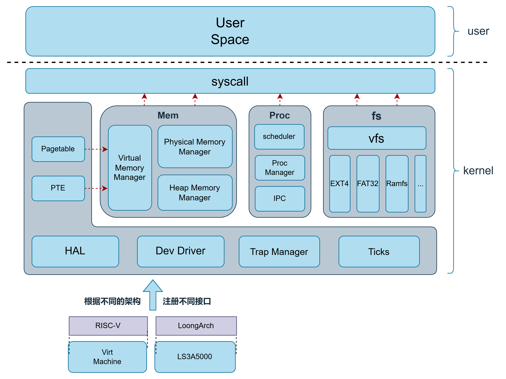

# F7LY OS

F7LY OS 是一个面向教学、比赛和 Linux ABI 兼容性评测的双架构操作系统内核。项目参考 xv6 的结构起步，当前已经演进为 C++23 freestanding 内核，重点覆盖 RISC-V 与 LoongArch 上的进程、线程、信号、mmap、futex、VFS、ext4、动态 ELF 装载和 LTP 回归场景。

当前仓库更适合作为 OS Demo、评测和内核实验环境使用，不是生产系统。LoongArch 分支能力仍在围绕 pthread、LL/SC、线程退出和 TLB 细节持续排障。



## 功能概览

- 双架构：RISC-V `virt` 与 LoongArch `virt` QEMU 环境。
- 内核语言：C++23 freestanding，禁用异常、RTTI 和宿主 libc 依赖。
- Linux ABI：使用 asm-generic 风格 syscall 编号，支持 BusyBox、musl/glibc 动态程序和大量 LTP 测例。
- 文件系统：以 ext4 根文件系统为主，保留 FAT32 数据盘和固件 DTB initrd/ramdisk 回退能力。
- 进程与线程：支持 `clone`、`clone3`、`fork`、`execve`、`wait4`、`exit_group`、futex、信号、POSIX timer 等接口。
- 内存管理：页表、伙伴系统、内核堆、slab、brk、mmap、共享内存、mprotect、mremap 等。
- I/O 与设备：UART、console、virtio block、loop、pipe/FIFO、eventfd、memfd、epoll 框架。
- 回归入口：用户态 `initcode` 直接运行回归套件，完成后调用 `shutdown()`。

## 环境要求

推荐环境为 Ubuntu 24.04 或等价 Linux 环境。

必须具备：

- `make`
- `bash`
- RISC-V 工具链：`riscv64-linux-gnu-gcc`、`riscv64-linux-gnu-g++`、`riscv64-linux-gnu-objcopy`
- LoongArch 工具链：`loongarch64-linux-gnu-gcc`、`loongarch64-linux-gnu-g++`、`loongarch64-linux-gnu-objcopy`
- QEMU：`qemu-system-riscv64`、`qemu-system-loongarch64`
- 调试器：`gdb-multiarch`、`loongarch64-linux-gnu-gdb`

镜像文件位于 `images/`：

- `images/oscomp-preliminary-riscv64.img`、
  `images/oscomp-preliminary-loongarch64.img`：初赛评测盘，供 `make run`
  使用。
- `images/oscomp-final-riscv64.img`、
  `images/oscomp-final-loongarch64.img`：决赛完整 rootfs，供
  `make shell` 使用。
- `images/bak/`：上述四个镜像的本地基线备份。

`make run`、`make shell` 和 `make debug` 启动 QEMU 前才检查镜像：先使用
`images/` 工作副本；工作副本缺失时从 `images/bak/` 复制；两者都缺失时
下载官方 `.xz`，校验后解压到 `bak`，再复制工作副本。`make build` 和
`make all` 只编译内核，不检查镜像、不访问网络。镜像体积很大，均由
`.gitignore` 排除。

## 快速开始

大赛完整构建入口（同时生成两种架构的 QEMU evaluation 内核）：

```bash
make all
```

`make` 的默认目标也是 `all`。完成后仓库根目录必须同时存在
`kernel-rv(.bin)` 与 `kernel-la(.bin)`。

构建 RISC-V：

```bash
make build PROFILE=riscv-qemu
```

构建 LoongArch：

```bash
make build PROFILE=loongarch-qemu
```

查看全部可用画像：

```bash
make profiles
```

运行 RISC-V：

```bash
make run PROFILE=riscv-qemu
```

运行 LoongArch：

```bash
make run PROFILE=loongarch-qemu
```

最终内核产物位于仓库根目录，中间对象位于各画像的独立 `build/` 子目录：

- RISC-V 内核 ELF/raw binary：`kernel-rv`、`kernel-rv.bin`
- LoongArch 内核 ELF/raw binary：`kernel-la`、`kernel-la.bin`
- 内嵌 initcode：`build/riscv-qemu/user/initcode.bin` 或
  `build/loongarch-qemu/user/initcode.bin`

清理构建产物：

```bash
make clean
```

## 调试

启动 RISC-V 调试目标：

```bash
make debug PROFILE=riscv-qemu
```

另开终端连接 GDB：

```bash
gdb-multiarch -x debug/gdb/riscv.gdb
```

启动 LoongArch 调试目标：

```bash
make debug PROFILE=loongarch-qemu
```

另开终端连接 GDB：

```bash
loongarch64-linux-gnu-gdb -x debug/gdb/loongarch.gdb
```

## 运行日志

完整回归输出很长，建议把 QEMU 输出写入日志文件，再用 `rg` 摘关键行：

```bash
ts=$(date +%Y%m%d-%H%M%S)
mkdir -p logs/run
log="logs/run/output_r_${ts}_final-2026_QEMU_MEM-8G_QEMU_SMP-8_timeout-40m.txt"
{
  echo "run_at=${ts}"
  echo "arch=riscv"
  echo "cmd=timeout 40m make run PROFILE=riscv-qemu QEMU_MEM=8G QEMU_SMP=8"
  echo "git_branch=$(git branch --show-current 2>/dev/null || true)"
  echo "git_head=$(git rev-parse --short HEAD 2>/dev/null || true)"
  echo "---- output ----"
  timeout 40m make run PROFILE=riscv-qemu QEMU_MEM=8G QEMU_SMP=8
  echo "exit_code=$?"
} > "$log" 2>&1
echo "$log"
```

LoongArch 只需把日志名前缀和画像改成 `PROFILE=loongarch-qemu`。单测调试建议把 timeout 控制在 5 分钟以内。

## 目录结构

| 路径 | 说明 |
| --- | --- |
| `kernel/` | 内核主体代码 |
| `mk/` | 构建配置、initcode、内核、QEMU 规则和平台画像 |
| `user/` | 用户态 initcode、syscall 封装和回归测试入口 |
| `busybox/` | 按架构和 libc 分类的 BusyBox 二进制 |
| `thirdparty/EASTL/` | 内核使用的 EASTL 容器库 |
| `tools/` | 镜像补丁、LTP 分析和其他开发工具 |
| `scripts/` | 挂载、镜像恢复、宿主机辅助运行脚本 |
| `debug/gdb/` | GDB 调试配置 |
| `images/` | 本地运行镜像和 sdcard 备份 |
| `logs/legacy/` | 历史 QEMU 输出样例 |
| `docs/archive/` | 历史设计文档、答辩材料和比赛总结 |
| `docs/dev-notes/` | 历史排障记录和上下文材料 |
| `docs/report-src/` | Typst 文档源文件 |
| `docs/assets/` | README 等长期文档使用的图片资源 |

## 内核模块

`kernel/` 采用“通用模块 + 架构子目录”的组织方式：

- `boot/`：架构启动入口和 `main()` 初始化流程。
- `hal/`：CPU、CSR、上下文切换等硬件抽象。
- `trap/`：异常、中断、syscall 入口和用户态返回。
- `mem/`：物理内存、页表、VMA、内核堆、slab 和用户空间拷贝。
- `proc/`：PCB、调度、clone/fork/exec/wait/exit、futex、signal、pipe、rlimit、POSIX timer。
- `sys/`：Linux ABI syscall 编号、分发表和 syscall 实现。
- `fs/`：VFS、ext4/lwext4、FAT32、虚拟文件、文件对象、块缓存。
- `devs/`：UART、console、virtio disk、ramdisk、loop、DTB 和设备管理器。
- `tm/`：时间、tick、sleep、clock_gettime 等接口。
- `shm/`：SysV shared memory 后端。
- `net/`：VirtIO Net 适配和 ONPS 协议栈集成。
- `libs/`：打印、字符串、锁、C++ ABI、全局 new/delete、qsort 等基础库。

## LTP 与回归分析

LTP 分析工具在 `tools/ltp/`：

- `tools/ltp/judge/judge_ltp_musl.py`
- `tools/ltp/judge/analyze_output.sh`
- `tools/ltp/judge/ltp_rank.txt`
- `tools/ltp/scoreboard/parse_ltp_scoreboard.py`
- `tools/ltp/scoreboard/generate_cpp_array.py`

运行 Python 分析脚本前，请按项目约定创建并激活 venv，再确认解释器路径：

```bash
uv venv
source .venv/bin/activate
which python
```

## 设计文档

长期文档和历史材料已经归档到 `docs/`：

- 决赛设计文档：`docs/archive/design/F7LY-OS-final-design.pdf`
- 现场赛文档：`docs/archive/design/F7LY-onsite-design.pdf`
- 初赛设计文档：`docs/archive/design/F7LY_OS-preliminary-design.pdf`
- 答辩材料：`docs/archive/presentations/F7LY-defense-slides-wuhan-university.pdf`
- Typst 文档源文件：`docs/report-src/`

历史文档可能落后于当前源码。判断当前行为时，优先看 `Makefile`、最近 Git commit、源码和 `AGENTS.md`。

## 开发约定

- 修改前先看 `git status --short` 和最近提交，避免覆盖他人改动。
- 不要把 `.env`、本地镜像、QEMU 长日志和构建产物提交进仓库。
- Python 命令必须在项目 venv 中执行。
- 新增或调整 syscall 时，同步更新 syscall 编号、声明、实现、绑定和必要的用户态封装。
- 调试单条测例时，优先缩小到一个架构、一个 libc 目录、一个测试大类和一个小测例。

更多协作规则见 `AGENTS.md`。

## 磁盘镜像准备

通常无需手动下载，首次 `make run` 或 `make shell` 会自动准备对应架构的
镜像。也可以只准备镜像而不启动 QEMU：

```bash
make prepare-image PROFILE=riscv-qemu MODE=evaluation
make prepare-image PROFILE=loongarch-qemu MODE=evaluation
make prepare-image PROFILE=riscv-qemu MODE=shell
make prepare-image PROFILE=loongarch-qemu MODE=shell
```

初赛盘来自 `pre-20250615` release，决赛完整 rootfs 来自
`on-site-final-2025-rv64-fs` 和 `on-site-final-2025-la64-fs` release。
具体 URL 集中维护在 `scripts/images/prepare-qemu-image.sh`，Makefile 不再
重复保存下载地址。

## 镜像源替换

在使用 `make shell` 的交互式 rootfs 中：

```bash
sed -i 's|https://mirrors.cernet.edu.cn/alpine|https://dl-cdn.alpinelinux.org/alpine|g' /etc/apk/repositories
```
