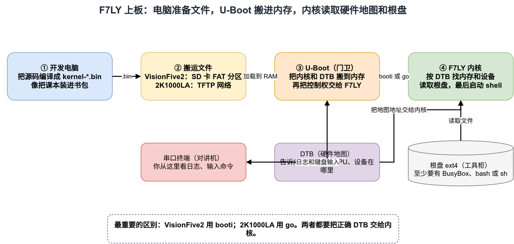

# F7LY 实机上板入门：从零到看到 Shell

这份说明只解决一个问题：怎样把刚编译好的 F7LY 放到真实开发板上，并在串口里看到可以输入命令的 Shell。

本文覆盖两块板：

- StarFive VisionFive2。
- LoongArch 2K1000LA 星云板，也就是 JL-LSGD2K10 / `LS2K1000-DP-V10` 这一硬件画像。

这里的“2K1000”不是所有叫 2K1000 的机器。老的 MIPS/LoongISA 2K1000、使用 PMON 的板子、资源布局不同的自制板，都不能照抄本文命令。

当前 2K1000LA 路径已经在 `LS2K1000-DP-V10` 实机完成从 U-Boot、SATA
根盘到交互 Shell 的验证。第一次上板时，仍应把本文当成一张“逐层验收单”：
每成功看到一个里程碑，再做下一步；不要一次同时改内核、DTB、磁盘和 U-Boot。

不用从头读到尾：VisionFive2 用户读第 1～4、6～8 节；2K1000LA 用户读第 1～3、5～8 节。一次只操作自己手里的那块板。

第一次启动的最短路线只有八步：

| VisionFive2 | 2K1000LA |
| --- | --- |
| 1. 编译 `-shell.bin` | 1. 编译 `-shell.bin` |
| 2. 串口进入 U-Boot | 2. 串口进入 U-Boot |
| 3. SD 卡准备 FAT + ext4 | 3. SATA 盘准备 ext4 |
| 4. 找到正确 mmc 分区 | 4. 电脑准备 TFTP |
| 5. `fatload` 内核和 DTB | 5. 复制并检查 DTB |
| 6. 检查 DTB 的板型 | 6. `tftpboot` 内核 |
| 7. 用 `booti` 启动 | 7. 用 `go` 启动 |
| 8. 看到 `F7LY:...$` | 8. 看到 `F7LY:...$` |

## 1. 先理解五样东西



可编辑原图在 [board-bringup-beginner.drawio](../docs/assets/board-bringup-beginner.drawio)。

可以把上板想成去一所陌生学校：

- `kernel-*.bin` 是 F7LY 内核，像要去上课的学生。
- U-Boot 是校门口的门卫。它先把内核从 SD 卡或网络搬进内存，再让内核运行。
- DTB 是学校地图。它告诉内核“内存在哪、CPU 有几个、串口和硬盘控制器在哪”。
- 根文件系统是工具柜，里面要有 BusyBox、`bash` 或 `sh`，否则内核启动了也没有命令可用。
- 串口是对讲机。开发板通过它打印日志，你也通过它输入命令。

整个过程的输入和输出是：

| 这一步 | 输入 | 输出 |
| --- | --- | --- |
| 编译 | F7LY 源码 | 板子能执行的 `.bin` 文件 |
| U-Boot 搬运 | `.bin` 和 DTB | 两个文件都进入板子 RAM |
| U-Boot 启动 | 内核地址和 DTB 地址 | CPU 开始执行 F7LY |
| F7LY 初始化 | DTB 和根盘 | 内存、串口、中断、磁盘、文件系统可用 |
| Shell 启动 | 根盘里的 BusyBox、`bash` 或 `sh` | 串口出现 `F7LY:...$` 提示符 |

最容易记错的区别只有一个：

| 板子 | 搬内核的方法 | 最后的启动命令 |
| --- | --- | --- |
| VisionFive2 | 从 SD 卡 FAT 分区读取 | `booti` |
| 2K1000LA | 推荐从 TFTP 网络读取 | `go` |

### 1.1 九个词的小词典

| 词 | 把它想成什么 |
| --- | --- |
| RAM / 内存 | 临时书桌；断电后桌上的东西消失 |
| FAT | U-Boot 会打开的启动文件柜 |
| ext4 | F7LY 会打开的 Linux 根盘格式 |
| TFTP | 用一根网线把文件从电脑送到板子 |
| UART / 串口 | 电脑和板子的文字对讲机 |
| PCB 版本 | 印在电路板上的硬件版本号 |
| SPI Flash | 保存固件的小芯片；断电也不会丢 |
| ELF | 给调试器看的完整内核文件，包含很多说明信息 |
| raw `.bin` | 只留下板子要执行的字节，适合直接搬进 RAM |

全文会出现三种“命令窗口”：

| 看到的提示符 | 命令应该输入在哪里 |
| --- | --- |
| `电脑 $` | 开发电脑的 Linux 终端 |
| `板子 =>` | 开发板的 U-Boot 串口终端 |
| `F7LY $` | 内核成功启动后的 Shell |

代码块没有把 `$` 和 `=>` 写进去，避免复制时把提示符也粘进去。每段命令前都会说明应该在哪个窗口执行。

## 2. 先记住安全边界

U-Boot 阶段只把内核和 DTB 放进 RAM。断电或复位以后，RAM 内容会消失，所以固件搬运失败通常可以直接重来。

但是 F7LY 一旦启动，会以读写方式挂载 ext4 根盘，并可能创建目录或更新文件系统元数据。因此 SD 卡和 SATA 根盘也必须是备用盘或可丢弃的克隆，不能使用唯一一份官方 Linux 系统盘。

第一次不要执行这些命令：

- 不要执行 `sf erase`、`sf write`，它们会改 SPI Flash。
- 不要执行 `mmc erase`、`mmc write`，它们会直接改 SD 卡扇区。
- 不要使用固件菜单里的 `Update kernel`，它通常期待 uImage，还可能写磁盘或 Flash。
- 不要执行 `saveenv`。先手敲命令启动成功，再考虑保存 U-Boot 环境变量。
- 不要把 `dd` 的目标猜成 `/dev/sda`。选错目标会把电脑硬盘清掉。

`fatload`、`tftpboot`、`fdt print`、`booti` 和 `go` 本身不会刷写 Flash；但 `booti` / `go` 启动 F7LY 后，F7LY 会读写根盘。制作根盘时的 `dd` 还会立即覆盖目标分区或整盘，所以文档把它单独标出来。

## 3. 开始前的共同准备

### 3.1 确认代码和工具链

在开发电脑的 F7LY 仓库根目录执行：

```bash
git status --short
```

VisionFive2 用户只检查 RISC-V 工具链：

```bash
riscv64-linux-gnu-g++ --version
```

2K1000LA 用户只检查 LoongArch 工具链：

```bash
loongarch64-linux-gnu-g++ --version
```

工具不存在时先安装自己板子需要的正确工具链，不要通过修改 Makefile 绕过。

### 3.2 一定要构建 Shell 版本

普通构建默认生成评测版本。评测版本会运行测试，不会停在交互终端，很容易被误认为“没有进 Shell”。

VisionFive2：

```bash
make build PROFILE=riscv-visionfive2 MODE=shell
ls -lh kernel-rv-visionfive2-shell kernel-rv-visionfive2-shell.bin
```

2K1000LA：

```bash
make build PROFILE=loongarch-2k1000 MODE=shell \
  LS2K1000_IPV4=192.168.1.20
ls -lh kernel-la-2k1000-shell kernel-la-2k1000-shell.bin
```

这里把 F7LY 的 2K1000LA 地址设成 `192.168.1.20`，避免它启动后和示例 TFTP 电脑的 `192.168.1.2` 冲突。第一次只看串口 Shell 时，内核网络并不是必需条件。

只把 `.bin` 交给 U-Boot。没有 `.bin` 后缀的文件是带调试信息的 ELF，留给开发电脑分析，不要在本文的命令里替换它。

### 3.3 打开串口终端

串口统一使用：

- 波特率：115200。
- 数据位：8。
- 停止位：1。
- 校验：无。
- 硬件流控：关闭。

插拔串口后，在 Linux 开发电脑查看新出现的设备：

```bash
dmesg | tail -30
ls -l /dev/ttyUSB* /dev/ttyACM* 2>/dev/null
```

假设实际设备是 `/dev/ttyUSB0`，可以使用：

```bash
sudo minicom -D /dev/ttyUSB0 -b 115200
```

不要照抄 `/dev/ttyUSB0`。同一个转接器换一个 USB 口，编号都可能改变。进入 minicom 后按 `Ctrl-A`、再按 `O`，在串口设置中确认 `Hardware Flow Control` 为 `No`；否则可能只能看输出，不能输入。

接好串口、打开终端以后再给板子上电。看到类似 `U-Boot ...` 和 `=>`，说明“电源、串口、固件”这一层已经通了。本文从 `=>` 提示符开始。

如果看到的是 `PMON>`，不要继续执行本文命令。那不是 U-Boot，而且当前 2K1000LA 入口也不是为 PMON 写的。

## 4. VisionFive2：一步一步启动

### 4.1 需要准备什么

准备：

- 一块 VisionFive2，板上已经有能进入 `=>` 的 OpenSBI 和 U-Boot。
- 3.3V USB-TTL 串口转接器。
- 一张备用 microSD 卡，建议 32 GB 或更大。
- `kernel-rv-visionfive2-shell.bin`。
- 与你的 VisionFive2 硬件版本完全匹配的 DTB。
- 一个包含 Shell 的 ext4 根分区。

VisionFive2 常见串口接线是：

| VisionFive2 物理针脚 | 连接到 USB-TTL |
| --- | --- |
| Pin 6，GND | GND |
| Pin 8，板子 TX | 转接器 RXD |
| Pin 10，板子 RX | 转接器 TXD |

只接 GND、TX、RX。不要连接转接器的 VCC，更不要使用 5V TTL 电平；开发板用自己的 USB-C 电源供电。

### 4.2 DTB 从哪里来

DTB 确实和板子强绑定，所以 F7LY 仓库没有随便放一个“万能 VF2 DTB”。你不需要手写 DTB，应该从这块板已经能成功启动的官方 Linux 镜像中复制。

先看 PCB 上印的硬件版本，例如 v1.2A 或 v1.3B。把官方 Linux 启动分区挂到电脑后寻找：

```bash
find <Linux启动分区的挂载目录> -type f \
  -name 'jh7110-starfive-visionfive-2*.dtb'
```

常见文件名会包含 `v1.2a`、`v1.3b`。选择和 PCB 版本相同的文件，把它重命名成简单的 `vf2.dtb`。如果不知道该选哪个，先停下来确认板卡版本，不要凭文件名猜。

### 4.3 准备 SD 卡

第一次推荐路线是使用一张“已经能启动官方 VisionFive2 Linux”的可丢弃克隆卡。不要把唯一能工作的原卡直接交给 F7LY；即使你没有手动写镜像，F7LY 启动后也会读写 ext4。克隆卡可以保留已验证的 U-Boot、分区表、引脚和时钟初始化流程，同时不威胁原卡数据。

卡上最终需要：

- 一个 U-Boot 能读取的 FAT 分区，里面放 `f7ly.bin` 和 `vf2.dtb`。
- 一个 ext4 分区，里面至少有 `/bin/busybox`、`/musl/busybox`、`/bin/bash`、`/bin/sh` 之一。

仓库中的 `images/oscomp-final-riscv64.img` 是决赛完整 rootfs 的裸 ext4 镜像。它不是完整 SD 卡镜像，不能覆盖整张卡；要写到 ext4 分区本身。

第一次可以不预先覆盖克隆卡的 ext4，只把两个启动文件复制到 FAT 分区；但这不表示根分区只读，F7LY 运行时仍可能修改它。若后来已经确认“内核能读 SD 卡，但克隆卡的根分区不适用”，再执行下面的备用方案。

备用方案是只覆盖克隆卡中“原本的 Linux 根 ext4 分区”。官方 VisionFive2 镜像前面可能还有 SPL、U-Boot 等小分区，FAT 和根分区常常不是第 1、2 分区；不要删除这些小分区，也不要按分区序号猜。

先用下面命令认准备用卡，并找到现有的 FAT 和 ext4。重点看容量、型号、文件系统和 `TRAN`：

```bash
lsblk -f -o NAME,PATH,SIZE,FSTYPE,LABEL,MODEL,TRAN,MOUNTPOINTS
```

根 ext4 分区应至少 4 GiB。可以先只读挂载候选分区，确认里面确实是 Linux 根目录，并检查四种 Shell 文件：

```bash
sudo mkdir -p /mnt/f7ly-vf2-check
sudo mount -o ro /dev/sdXN /mnt/f7ly-vf2-check
ls -l /mnt/f7ly-vf2-check/bin/busybox \
  /mnt/f7ly-vf2-check/musl/busybox \
  /mnt/f7ly-vf2-check/bin/bash \
  /mnt/f7ly-vf2-check/bin/sh 2>/dev/null
sudo umount /mnt/f7ly-vf2-check
```

这里的 `/dev/sdXN` 只是“你已经确认过的根 ext4 分区”占位符，例如某些卡可能是 `/dev/sdX4`。如果卡上有多个 ext4，当前 F7LY 会按分区表顺序选择第一个；第一次应换用布局明确的克隆卡，不要猜它会选哪个。

执行 `dd` 前拔掉其他移动硬盘，再执行一次 `lsblk`。只要不能百分之百确认设备名，就不要执行 `dd`，也不要让别人替你猜。

下面是破坏性命令。只有在你已经确认 `/dev/sdXN` 是克隆卡的根 ext4 分区，而且容量不小于 4 GiB 时，才替换占位符：

```bash
sudo umount /dev/sdXN
sudo dd if=images/oscomp-final-riscv64.img of=/dev/sdXN \
  bs=4M status=progress conv=fsync
```

再次强调：目标是已经核实内容和容量的根 ext4 分区，不是“固定第二分区”，也不是整盘。

把 FAT 分区重新挂载后复制：

```bash
cp kernel-rv-visionfive2-shell.bin <FAT挂载目录>/f7ly.bin
cp <正确的VisionFive2-DTB> <FAT挂载目录>/vf2.dtb
sync
```

安全弹出 SD 卡，再插到 VisionFive2。

### 4.4 在 U-Boot 中找到 SD 卡和 FAT 分区

下面命令都在 `=>` 后输入，不是在 Linux 的 `$` 后输入。先只查看，不启动：

```console
mmc list
```

先从输出中找到 microSD。下面才是假设它的设备号为 1 的示例；如果实际不是 1，要把后续所有 `mmc 1` 一起替换：

```console
mmc dev 1
mmc rescan
part list mmc 1
fatls mmc 1:1 /
```

VisionFive2 上 microSD 常见为 `mmc 1`，但这不是永远不变的真理。你要根据 `mmc list` 和 `part list` 的实际输出选择设备号和 FAT 分区号。

如果 `fatls mmc 1:1 /` 能看到 `f7ly.bin` 和 `vf2.dtb`，记住当前组合就是 `1:1`。看不到时，不要继续启动；先检查是否选错 FAT 分区，例如卡的 FAT 分区可能是 `1:3`。

### 4.5 检查 DTB，再启动内核

以下示例假设刚才找到的是 `mmc 1:1`：

```console
setenv kernel_addr_r 0x40200000
setenv fdt_addr_r 0x46000000

fatload mmc 1:1 ${kernel_addr_r} f7ly.bin
fatload mmc 1:1 ${fdt_addr_r} vf2.dtb

fdt addr ${fdt_addr_r}
fdt print / model
fdt print / compatible
fdt print /cpus timebase-frequency
```

两条 `fatload` 都必须报告大于 0 的 `bytes read`。任意一条没有读到文件，就停在这里，不要执行 `booti`。

先阅读输出：

- `model` 应明确是 VisionFive 2。
- `compatible` 应包含 JH7110 / VisionFive2 对应字符串。
- `timebase-frequency` 通常应是 4,000,000 Hz。

只要 `fdt` 报错，或者型号与 PCB 不一致，就不要执行下一条命令。

某些 VisionFive2 固件带有板级准备脚本。可以先查看：

```console
printenv chipa_set_linux
```

只有当它确实存在时才执行：

```console
run chipa_set_linux
```

最后启动：

```console
booti ${kernel_addr_r} - ${fdt_addr_r}
```

中间的 `-` 表示“没有 initrd”，不是减号计算。不要把这条命令换成旧分支的 `go 0x40200000`；`go` 不会按 RISC-V 标准把 hart id 和 DTB 地址交给当前内核。

第一次成功前不要 `saveenv`。

### 4.6 你应该看到什么

按顺序关注这些里程碑。日志中的地址和容量可以不同，阶段名应大致一致：

```text
Bytes read ...
Flattened Device Tree blob ...
Starting kernel ...
[boot] early runtime begin
[boot] C++ runtime ready
[DTB] firmware address valid: ...
[DTB] blob ready: ...
[boot] profile=StarFive VisionFive 2 ...
[PLIC] hart=... raw-context=...
[clock] DTB timebase-frequency=4000000 Hz
[dwmmc] output: card ready ...
[block] backend=visionfive2-jh7110-dwmmc ...
[fs] 根文件系统已挂载到 /
[boot] stage=scheduler start
#### F7LY INTERACTIVE SHELL START ####
F7LY:...$
```

看到 `F7LY:...$` 就说明最小上板成功。先做只读检查：

```sh
pwd
ls /
echo F7LY_VF2_BOOT_OK
```

### 4.7 VisionFive2 卡住时怎么看

| 最后一条可见信息 | 说明已经成功到哪 | 下一步只查什么 |
| --- | --- | --- |
| 完全没有 U-Boot 字符 | 还没到内核 | 电源、GND/TX/RX、TX/RX 是否交叉、115200、3.3V、U-Boot 是否安装 |
| `fatls` 看不到文件 | U-Boot 已工作 | mmc 设备号、FAT 分区号、文件名、是否执行 `sync` |
| `Bad Linux RISC-V Image` | 文件已读进 RAM | 是否误用了 ELF、旧 `.bin` 或损坏文件；重新构建 Shell `.bin` |
| `fdt print` 失败或型号不对 | DTB 已读进 RAM | DTB 文件、加载地址和硬件版本 |
| `Starting kernel` 后完全无字 | 已执行 `booti` | 是否误用旧固件、OpenSBI 是否支持当前 SBI 串口、DTB 是否匹配；保存完整日志 |
| `[PLIC]` 报 DTB context 错误 | 内核已解析 DTB | 换用包含正确 `interrupts-extended` 的板级 DTB |
| `[dwmmc] ... failed` | 内存和中断大致已好 | SD 卡、SDIO1 时钟/复位、固件板级准备脚本、卡接触 |
| 有 `[block]`，没有 ext4 | SD 驱动已好 | 是否把 `oscomp-final-riscv64.img` 写到了正确 ext4 分区、分区表是否正确 |
| 根文件系统挂载成功但没有 Shell | 内核和磁盘已好 | 根分区是否有 BusyBox、`bash` 或 `sh` |

## 5. 2K1000LA：一步一步启动

### 5.1 先确认它真的是本文支持的板

当前 F7LY 画像针对：

- LoongArch 架构的 2K1000LA。
- 星云板 / JL-LSGD2K10。
- DTB model 为 `LS2K1000-DP-V10` 的资源布局。
- U-Boot 固件。

它不支持老的 MIPS/LoongISA 2K1000，也不能把 PMON 当 U-Boot 使用。

2K1000LA 星云板应使用板载 MicroUSB `USB_DEBUG/UART0`。不要根据 VisionFive2 的接线表给它接针脚；如果你使用的是 DB9 串口，还要确认它是 RS-232 电平，不能直接接 3.3V USB-TTL。

进入 `=>` 后先执行：

```console
version
bdinfo
help go
help fdt
help tftpboot
printenv fdtcontroladdr
```

如果没有 `go`、`fdt`、`tftpboot`，或者提示符是 PMON，就停止。先记录板卡型号和固件版本，不能靠猜命令继续。

如果 `printenv fdtcontroladdr` 打印出了地址，可以只用它核对固件认识的板型：

```console
fdt addr ${fdtcontroladdr}
fdt print / model
fdt print / compatible
```

这一步只看型号，不把 control DTB 直接交给 F7LY；第 5.4 节会准备内核使用的 DTB。

### 5.2 准备 SATA 根盘

F7LY 当前通过板载 AHCI 读取 SATA port 0。最确定的根盘是仓库里的 `images/oscomp-final-loongarch64.img`：它是决赛完整 rootfs 的裸 ext4 镜像。

不要优先使用 `images/rootfs-loongarch64.img`；当前工作区里的该镜像被文件系统检查标记为有错误。

建议使用一块没有重要数据的备用 SATA SSD/HDD，并先通过 USB-SATA 转接器接到开发电脑。确认设备：

```bash
lsblk -o NAME,PATH,SIZE,MODEL,TRAN,MOUNTPOINTS
```

执行 `dd` 前拔掉其他移动硬盘，再执行一次 `lsblk`。只要不能百分之百确认目标就是备用 SATA 盘，就不要继续。

下面会覆盖整块备用盘。只有确认真实目标就是 `/dev/sdX` 后，才替换占位符：

```bash
sudo umount /dev/sdX* 2>/dev/null || true
sudo dd if=images/oscomp-final-loongarch64.img of=/dev/sdX \
  bs=4M status=progress conv=fsync
sync
```

这一次目标是整块备用 SATA 盘 `/dev/sdX`；VisionFive2 则只覆盖核实过的根 ext4 分区。两种 `dd` 目标不能混用。

安全弹出硬盘，把 SATA 数据线和电源接到星云板的 SATA port 0。如果盘里已有重要 Linux 系统，先做备份，不要执行上述 `dd`。

### 5.3 在开发电脑准备 TFTP

下面以电脑地址 `192.168.1.2`、开发板地址 `192.168.1.20` 为例。电脑和板子网线直连或接到同一个交换机，掩码都是 `255.255.255.0`。

先在电脑的“设置 → 网络 → 有线网络 → IPv4”中选择“手动”，把专门连接开发板的有线网口设为：

- 地址：`192.168.1.2`。
- 子网掩码：`255.255.255.0`，也可以写成 `/24`。
- 网关：第一次直连时留空。

然后在开发电脑终端确认：

```bash
ip -br addr
```

负责连接开发板的有线网口那一行必须出现 `192.168.1.2/24`。没有出现就先修好电脑网络，不要去改内核。

Ubuntu/Debian 可以安装 `tftpd-hpa`：

```bash
sudo apt install tftpd-hpa
grep TFTP_DIRECTORY /etc/default/tftpd-hpa
```

先看 `TFTP_DIRECTORY` 的真实值。假设它是 `/srv/tftp`，复制内核：

```bash
sudo install -m 0644 kernel-la-2k1000-shell.bin \
  /srv/tftp/kernel-la-2k1000-shell.bin
sudo systemctl restart tftpd-hpa
```

电脑的防火墙需要允许 TFTP/UDP 69。双网口星云板通常应先使用靠近电源的网口 1。

### 5.4 把匹配板型的 DTB 放进 TFTP

本文第一次启动只走一条确定路线：使用仓库中和 JL-LSGD2K10 同板维护的 DTB。它已经静态核对为 `LS2K1000-DP-V10`，memory 节点使用 F7LY 需要的低物理坐标。

只有在实际板型已经确认是 JL-LSGD2K10 / `LS2K1000-DP-V10` 时，才复制：

```bash
sudo install -m 0644 \
  ref/tgoskits/os/StarryOS/configs/board/jl-lsgd2k10.dtb \
  /srv/tftp/jl-lsgd2k10.dtb
```

板子的 U-Boot 通常也带一份 control DTB，但那份 DTB 是给 U-Boot 自己用的：它的 memory 地址可能写成 `0x9000...` DMW 坐标，当前 F7LY 物理内存管理器不能直接使用。因此第一次不要复用 `fdtcontroladdr`。这正是“板子有 DTB，却仍要给内核准备匹配 DTB”的原因。

如果实际板型不同，就停止。不要为了“先跑起来”给另一块板硬塞这个 DTB。

### 5.5 从 TFTP 把内核放进 RAM

先配置临时网络变量：

```console
setenv serverip 192.168.1.2
setenv ipaddr 192.168.1.20
setenv netmask 255.255.255.0
printenv ethact ethprime
ping ${serverip}
```

成功时 U-Boot 会打印 `host 192.168.1.2 is alive` 或意思相同的信息。没有收到回复，就停在这里检查电脑 IP、网线、防火墙和网口；双网口固件还要确认 `ethact` 对应实际插线的网口，不要猜一个不存在的名字。

`ping` 成功以后，先加载并检查 DTB。相同 JL-LSGD2K10 的 StarryOS 使用下面的 DTB 地址；它与当前 F7LY 内核不重叠，但仍应先用前面的 `bdinfo` 确认属于可用 RAM：

```console
setenv fdt_addr 0x900000000a000000
tftpboot ${fdt_addr} jl-lsgd2k10.dtb
fdt addr ${fdt_addr}
fdt print / model
fdt print / compatible
fdt print /memory@200000 reg
fdt print /cpus
```

`tftpboot` 必须报告大于 0 的 `Bytes transferred`；`model` 必须是 `LS2K1000-DP-V10`；memory 必须从低物理地址 `0x00200000` 开始；`/cpus` 必须能列出 CPU。任意一项不对就停止，不要加载内核。

然后加载内核：

```console
setenv kernel_addr 0x9000000000200000
tftpboot ${kernel_addr} kernel-la-2k1000-shell.bin
```

`tftpboot` 必须报告大于 0 的 `Bytes transferred`。文件没传完时不要执行 `go`。

这里同时存在两种“地址写法”：

- 链接脚本中的物理坐标是 `0x00200000`。
- 2K1000LA U-Boot 命令使用缓存 DMW 地址 `0x9000000000200000`。

它们指向同一块 RAM。U-Boot 的可用内存表使用高地址窗口，因此 `tftpboot` 和 `go` 都写高地址；不要把物理坐标直接填进 TFTP 命令。

看到 `Bytes transferred` 后再启动：

```console
go ${kernel_addr} ${fdt_addr}
```

第二个参数不能省。当前内核会把它当作 DTB 地址；如果省略，会明确 panic。

这里不能改用 `booti` 或 `bootm`，因为 2K1000LA 产物是 raw `.bin`，不是 Linux Image 或 uImage。第一次成功前也不要 `saveenv`。

### 5.6 你应该看到什么

依次寻找：

```text
[early] entry reached
[boot] stage=firmware begin
[DTB] firmware address valid: ...
[DTB] blob ready: ...
[pmm] input: ...
[pmm] output: ...
[boot] stage=interrupts ready ...
[ahci] output: SATA disk ready ...
[block] backend=ls2k1000-ahci ... layout=raw-ext4
[fs] 根文件系统已挂载到 /
[boot] stage=scheduler start
#### F7LY INTERACTIVE SHELL START ####
F7LY:...$
```

看到 Shell 后先做只读检查：

```sh
pwd
ls /
echo F7LY_2K1000_BOOT_OK
```

### 5.7 日常开发循环

第一次按照前文手动验证成功后，后续开发使用仓库脚本自动完成构建、发布、
等待 U-Boot、加载 DTB/内核和串口日志记录：

```bash
# 修改内核后重新编译并下板
./scripts/board/2k1000-dev.sh build

# 复用当前 kernel-la-2k1000-shell.bin 直接下板
./scripts/board/2k1000-dev.sh send
```

脚本默认使用板子 `192.168.5.20`、TFTP 主机 `192.168.5.17` 和
`/dev/ttyUSB0`，可通过 `BOARD_IP`、`SERVER_IP`、`SERIAL_DEVICE`、
`TFTP_DIR` 等同名环境变量覆盖。运行日志写入 `logs/run/`，最新一份固定由
`logs/run/output_2k1000_latest.txt` 指向。

### 5.8 2K1000LA 卡住时怎么看

| 最后一条可见信息 | 说明已经成功到哪 | 下一步只查什么 |
| --- | --- | --- |
| 没有 U-Boot 字符 | 还没到内核 | 板卡供电、USB_DEBUG、实际 tty 设备、115200、8N1、关闭流控 |
| 看到 `PMON>` | 固件不是本文前提 | 停止；确认是否为老架构 2K1000，准备 U-Boot 或重新设计入口 |
| `ping` / `tftpboot` 失败 | U-Boot 和串口已好 | 两端 IP、网线、TFTP 根目录、防火墙、靠电源网口 |
| `go` 后没有 `[early]` | 文件搬运完成但没进正确入口 | 是否用了 LoongArch `.bin`，以及 `tftpboot` 和 `go` 是否都用了 `0x9000000000200000` |
| 只有 `[early] entry reached` | CPU 已到内核第一条路径 | 保存从上电开始的完整日志，检查 BSS/构造/串口交接，不要改磁盘 |
| DTB panic | 入口和串口已好 | 是否传了第二个参数、DTB magic、复制地址、型号和 RAM 重叠 |
| `[pmm]` panic | DTB 已能读取 | DTB memory 节点是否属于当前板、是否包含内核所在物理区间 |
| `[ahci] ... link timeout` | 内存、中断、驱动入口已好 | SSD 电源、SATA 线、port 0、盘是否正常 |
| AHCI ready，但没有 ext4 | SATA 驱动已好 | 是否把 `oscomp-final-loongarch64.img` 写到正确整盘、镜像是否干净 |
| 根文件系统挂载成功但没有 Shell | 内核和磁盘已好 | 根盘是否有 BusyBox、`bash` 或 `sh` |
| 能输出但键盘没反应 | 大部分启动已成功 | UART0 输入、中断控制器和 DTB；记录按键前后的完整日志 |
| 很快关机 | 可能启动了评测版本 | 重新确认文件名中有 `-shell.bin`，不要在 Shell 中输入 `exit` |

## 6. 为什么两块板的命令不同

VisionFive2 的 `.bin` 前面带标准 RISC-V Linux Image 头。U-Boot 的 `booti` 会读这个头，并按 RISC-V 约定把 `hartid + DTB` 交给内核。

2K1000LA 当前是直接装载的 raw binary。它在链接脚本里的物理坐标是 `0x00200000`；2K1000LA U-Boot 通过对应的缓存 DMW 地址 `0x9000000000200000` 搬运和执行，同时把 DTB 地址作为命令参数传入。

这不是“哪个命令更高级”的区别，而是两个内核镜像与固件约定不同。照着各自契约做，设计反而最简单。

## 7. 第一次失败时，请保留这些信息

不要只说“卡死了”。请保存：

- 开发板正反面照片和 PCB 版本。
- 串口从上电第一行开始的完整文本。
- U-Boot `version` 输出。
- U-Boot `bdinfo` 输出。
- `fdt print / model` 和 `fdt print / compatible` 输出。
- 实际执行的 `fatload` / `tftpboot` / `booti` / `go` 命令。
- `fatload` 或 `tftpboot` 报告的文件字节数。
- 最后一条 F7LY 日志，不要只截最后一个 `panic` 单词。

有了这些信息，就能按“固件 → 搬运 → 入口 → DTB → 内存 → 磁盘 → 文件系统 → Shell”一层一层排查，而不是同时猜十件事。

## 8. 参考资料

- [VisionFive2 官方快速入门手册](https://doc-en.rvspace.org/VisionFive2/PDF/VisionFive2_QSG.pdf)
- [VisionFive2 官方 microSD 启动说明](https://doc-en.rvspace.org/VisionFive2/SWTRM/VisionFive_2/method_1_using_micro-sd_card%20-%20vf2.html)
- [U-Boot `booti` 官方说明](https://docs.u-boot.org/en/latest/usage/cmd/booti.html)
- [U-Boot `fdt` 官方说明](https://docs.u-boot.org/en/latest/usage/cmd/fdt.html)
- [RISC-V Linux 启动 ABI](https://docs.kernel.org/arch/riscv/boot.html)
- [2K1000 星云板用户手册 V1.1](https://github.com/LoongsonLab/oscomp-documents/blob/main/pdf/%E5%B9%BF%E4%B8%9C%E9%BE%99%E8%8A%AF2K1000%E6%98%9F%E4%BA%91%E6%9D%BF%E7%94%A8%E6%88%B7%E6%89%8CV1.1.pdf)
- [Loongson 2K1000LA 产品与处理器资料](https://loongson.cn/product/show?id=8)
- [原 2K1000 与 2K1000LA 架构区别](https://www.loongson.cn/news/show?id=576)
- [本仓库构建与调试说明](development_debugging.md)
- [本仓库平台重构设计](platform_refactor_design.md)
