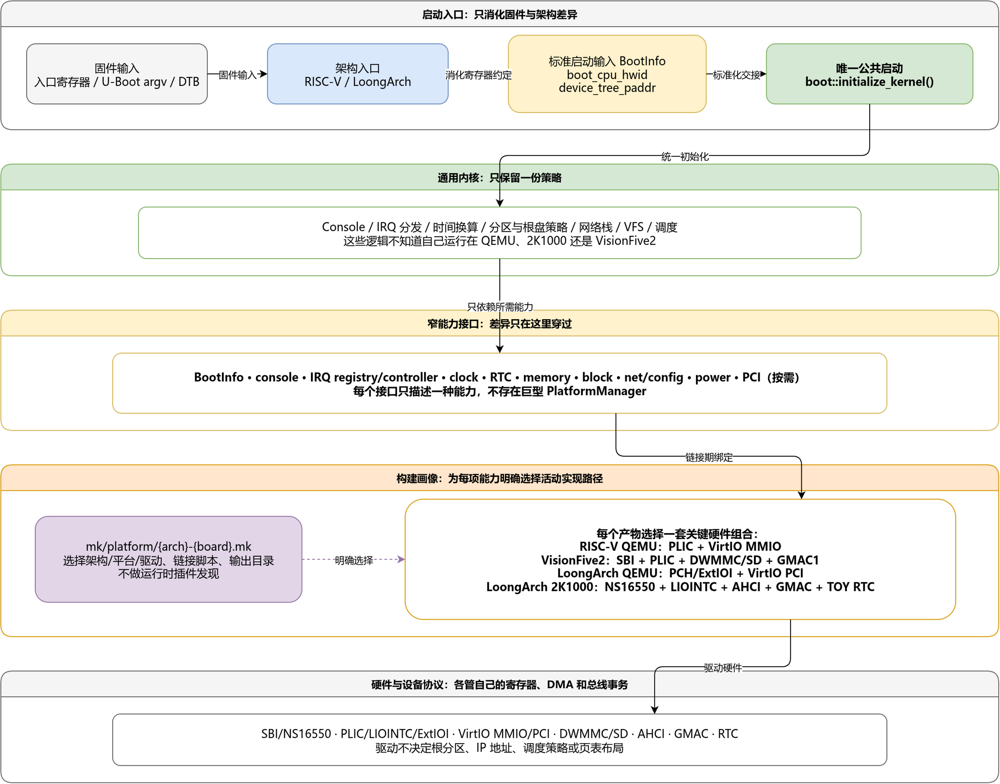

# 平台重构设计：用最少的边界支持不同机器

## 结论先行

本次重构没有建立一套“万能平台框架”。它只做了两件必要的事：

1. 构建时确定目标机器，只把这台机器需要的实现链接进内核。
2. 运行时让通用内核通过少量、按能力划分的接口使用硬件。

可以把现在的内核产物理解为：

> 一个内核产物 = 一份通用内核 + 构建画像选中的架构实现、平台实现和设备后端。

能在构建时决定的事情，不留到运行时猜测；只有 DTB、PCI capability、磁盘分区等真正的运行数据，才在启动时解析。

这里采用的奥卡姆剃刀原则不是“代码行数越少越好”，而是：在同时满足两种 QEMU、2K1000 和 VisionFive2 开发需求的前提下，让概念、状态所有者和选择路径尽可能少。

## 1. 原来的根问题

旧代码没有明确回答三个问题：

- 谁决定本次使用哪一种硬件实现？
- 谁拥有 MMIO 地址、中断号、时钟频率等硬件事实？
- 谁负责中断分发、分区识别、网络配置等通用语义？

因此出现了一组互相强化的问题：

- QEMU 的设备布局被误当成 RISC-V 或 LoongArch 的架构事实。
- 架构入口分别复制整套内核初始化流程，修改一个平台时容易漏掉另一个。
- trap 直接判断 UART、VirtIO 等设备；VFS 和网络栈直接选择具体驱动。
- 同一地址、IRQ、容量或频率在多个模块重复定义。
- 多块板的驱动一起进入构建，再依靠 `#ifdef` 或空实现决定谁生效。
- 新增开发板需要修改大量与该板无关的公共代码。

这些问题看起来分散，实际只有一个根因：架构机制、板级组合、设备协议和通用策略没有分开。

## 2. 四条最小设计规则

### 2.1 一个事实只有一个权威来源

同一硬件地址不能同时出现在启动汇编、驱动和内存布局头文件中；同一分区偏移不能同时由驱动、BIO 和 VFS 保存。重复保存会让代码在局部看起来方便，却使系统整体无法判断哪一份才是真的。

### 2.2 构建时已知的选择在构建时完成

构建 2K1000 镜像时，已经知道它不需要 QEMU VirtIO PCI；没有必要把两套实现都放进内核再在启动时判断。构建画像直接选择源文件，错误组合会在编译或链接阶段暴露。

### 2.3 通用代码只依赖稳定语义

文件系统需要的是“读写扇区和查询容量”，不是 AHCI；网络栈需要的是“收发以太网帧”，不是 GMAC；trap 需要的是“领取并完成一个 IRQ 事务”，不是 PLIC 或 LIOINTC。

### 2.4 只为真实变化建立接口

没有引入动态插件、驱动工厂、复杂设备树注册框架或巨型 `PlatformManager`。当前只有少量明确画像，编译期组合和窄函数接口已经足够。未来确实出现新的稳定语义时再扩展接口，而不是为假想需求预先制造框架。

## 3. 现在的最小模型



可编辑源文件：[platform-refactor-architecture.drawio](../docs/assets/platform-refactor-architecture.drawio)。

图中最重要的不是目录名称，而是单向依赖：

```text
固件输入
  -> 架构入口
  -> BootInfo
  -> 唯一公共启动流程
  -> 通用子系统
  -> 窄能力接口
  -> 当前画像为这项能力选中的活动实现路径
  -> 硬件
```

构建画像从侧面选择实现，但不进入运行时策略。通用代码可以依赖接口，平台后端可以依赖架构机制，具体驱动可以操作设备；反方向依赖不允许出现。

## 4. 几个名词的准确含义

| 名词 | 含义 | 例子 |
| --- | --- | --- |
| 架构 | ISA 和 CPU 机制 | RISC-V CSR、LoongArch CSR、页表、TLB、trap、上下文切换 |
| 板级平台 | 一台机器的设备拓扑和启动约定 | QEMU virt、Loongson 2K1000、VisionFive2 |
| 构建画像 | 一次构建的选择规则，不是一层运行时代码 | `riscv-qemu`、`riscv-visionfive2`、`loongarch-qemu`、`loongarch-2k1000` |
| 通用逻辑 | 不应认识具体板名的内核语义 | IRQ 分发、分区识别、网络栈、VFS、时间换算 |
| 后端 | 对某一种能力的具体平台实现 | PLIC、LIOINTC、AHCI、GMAC |
| 传输层 | 同一设备协议通过不同总线访问的差异 | VirtIO MMIO、VirtIO PCI |
| 固件输入 | 机器启动时交给架构入口的数据 | 入口寄存器、U-Boot argv、DTB |
| 标准启动输入 | 架构入口消化固件 ABI 后交给公共内核的最小对象 | `BootInfo` |

“通用”不表示没有耦合，而是只保留对稳定小接口的、有意耦合。

## 5. 为什么用编译期画像

[Makefile](../Makefile) 用 `ARCH + BOARD` 定位一份 [平台画像](../mk/platform/)。画像只负责以下选择：

- 平台实现目录；
- 精确的块设备、网络和控制器源文件；
- 链接脚本；
- 独立输出目录和镜像名称；
- 少量该画像专属的编译配置。

当前四份画像分别是：

| 画像 | 架构机制 | 中断 | 块设备 | 网络 |
| --- | --- | --- | --- | --- |
| `riscv-qemu` | RISC-V | PLIC | VirtIO MMIO | VirtIO MMIO |
| `riscv-visionfive2` | RISC-V | PLIC（DTB context） | JH7110 DWMMC/SD | JH7110 GMAC1 |
| `loongarch-qemu` | LoongArch | PCH PIC + ExtIOI | VirtIO PCI | VirtIO PCI |
| `loongarch-2k1000` | LoongArch | LIOINTC | AHCI | GMAC |

这样设计的原因很简单：一个内核镜像当前只需要启动一种机器。精确链接比“把所有驱动编进去再判断”更容易审计，也让缺少实现直接表现为链接错误。

有意接受的限制是：一个镜像不会自动适配所有板子。对于当前项目，这比维护运行时插件系统更简单、更可靠。

编译期画像并不排斥运行时发现。画像决定“使用哪类实现”；DTB、PCI 和磁盘元数据决定“本次实际有哪些资源和实例”。

## 6. 为什么不用巨型 Platform 类

当前公共契约刻意按能力拆开：

| 契约 | 通用层真正需要的内容 | 明确不负责的内容 |
| --- | --- | --- |
| `BootInfo` | 引导 CPU 硬件 ID、DTB 物理地址 | 任意设备对象和全局配置仓库 |
| console backend | 初始化、非阻塞收发字符、线路状态 | TTY 行规程和日志策略 |
| IRQ registry | `source -> handler` 注册与 dispatch | 控制器寄存器和设备状态确认 |
| IRQ controller backend | source enable、claim、complete | handler 所属设备的业务处理 |
| clock backend | 单调计数器及频率 | RTC 日期、调度 tick 和时间换算策略 |
| RTC backend | 可选 Unix epoch 墙钟 | 单调计时和定时事件 |
| block backend | 512 字节扇区读写、容量 | MBR、GPT、ext4 和根盘选择 |
| net backend | 初始化、收发帧、MAC | IP、网关、DNS 和协议栈生命周期 |
| memory backend | 物理地址与内核可访问别名的转换 | 通用页分配和进程内存策略 |
| power backend | 关机或安全停驻 | 调度和设备电源管理框架 |
| PCI host | BDF、配置空间、BAR 映射 | VirtIO feature、队列和块/网卡语义 |

如果合成一个巨型 `Platform`，每块板都必须实现大量无关方法，并产生空桩、默认返回成功或跨模块状态。小接口让 console 的变化只影响 console，让 IRQ 的变化只影响 IRQ。

这里也没有把每个寄存器访问都包装成接口。只有“通用代码确实需要，而且平台之间确实不同”的语义才形成边界。

## 7. 启动流程为什么只能有一份

架构入口现在只完成无法共享的工作：消化入口寄存器或 U-Boot argv，建立最早期执行环境，在需要时输出有界的早期标记，并把固件差异归一化为 `BootInfo`。随后由 SMP 层选出唯一 bootstrap CPU，校验 DTB、建立 CPU topology，再进入公共启动。

之后统一进入 [kernel_init.cc](../kernel/boot/kernel_init.cc)。文档不复制每个初始化函数的完整顺序，只固定以下依赖不变量：

1. BSS 清零和 C++ 全局构造都只能执行一次；其他 CPU 必须等它们完成后才能使用全局对象。
2. 每个 IRQ source 都必须先有 handler owner，控制器或设备才能开放该 source。
3. 当前 CPU 的 trap vector 和 IRQ context 必须先就绪，随后才能初始化可能等待中断的设备。
4. 块设备必须先就绪，VFS 才能识别并挂载介质。
5. 全局状态、根盘和 VFS 稳定后，才放行次核和调度器。

RISC-V 和 LoongArch 的次核启动都有有界等待。某个 hart 没有响应时，系统收缩到已经在线的 CPU，而不是让引导核永久卡死。

集中启动不是为了形式统一，而是为了确保“改一次初始化依赖，所有平台同时得到同一修复”。

裸机运行时也属于启动契约，不能依赖 QEMU loader 的偶然行为：

- QEMU 加载 ELF 时可能顺便得到已清零的 BSS，U-Boot 加载 raw binary 不保证这一点，所以内核显式清零普通 BSS。
- 启动栈放在独立的 `.bss.stack`，清零范围不能覆盖 CPU 正在使用的栈。
- 链接脚本保留 `.init_array`，内核在使用带构造函数的全局对象前显式运行 C++ 构造。
- ELF 分为 RX、R、RW 三类装载段，不把可写数据和可执行代码放进同一 RWX 段。
- 2K1000 的 AHCI/GMAC 使用独立 `.dma_uncached` 区，CPU 只经非缓存别名访问，避免非一致性 cache 覆盖设备描述符或数据。
- VisionFive2 的 raw Image 以前 64 bytes 保存标准 RISC-V Linux Image v0.2 头，U-Boot 通过 `booti` 进入并传递 `hartid + DTB`；不再接受只传 `argc/argv` 的 `go` 命令。

## 8. 硬件信息放在哪里

不同事实的生命周期不同，因此来源也不同：

| 信息 | 当前权威来源 | 原因 |
| --- | --- | --- |
| 目标架构、板型和后端集合 | 构建画像 | 构建时已经确定 |
| CSR、异常语义、页表编码 | 架构层 | 属于 ISA 不变量 |
| 当前启动所用的 CPU、RAM、memreserve、`reserved-memory`、initrd | DTB | 由本次固件启动描述 |
| 已知机器的固定 SoC MMIO、IRQ 和能力参数 | 对应平台的集中 typed 配置 | 属于该画像明确记录的硬件契约 |
| DTB 子总线地址 | `ranges` 逐级翻译 | 子总线地址不一定等于 CPU 物理地址 |
| 磁盘容量、PCI capability、分区表 | 设备和介质元数据 | 属于运行数据 |
| handler、在线 CPU 等状态 | 有界运行时注册表 | 启动过程中建立 |

当前实现没有宣称“所有设备地址都来自 DTB”。2K1000 的固定 SoC 资源集中在平台配置中；DTB 是当前 CPU、内存、保留区和可选 initrd 的权威来源，也用于按 `reg + ranges` 找到与 GMAC 物理地址匹配的节点，再读取每台机器可能变化的 MAC。两者并不冲突：静态配置说明“这类板固定怎样连线”，DTB 说明“这次启动的实例数据是什么”。

以后扩大 DTB 设备发现时，应在平台层把解析结果一次转换成 typed resource，再交给驱动，而不是让每个驱动各自遍历 DTB。允许经过画像明确记录的静态启动契约；禁止 DTB 解析失败后静默使用跨平台经验地址。当前内存路径不会扫描 RAM 或猜测 `PHYSTOP`，因为这种“偶尔能启动”比显式失败更难诊断。

## 9. 各子系统为什么这样分层

### 9.1 中断

trap 只调用公共分发入口。IRQ registry 保存 `source -> handler`，控制器后端只负责 source 的 enable、claim 和 complete，设备驱动只确认自己的设备状态。

`ClaimToken` 同时保存公共 pending 位图和控制器原始令牌，保证 PLIC 的单 IRQ 和 LoongArch 位图控制器都能成对完成事务。PCI INTx 的共享中断由固定小槽位支持，中断热路径不分配内存。

这样新增控制器只需更换 backend，不需要在 trap 中继续添加设备分支。

### 9.2 存储

AHCI 和 VirtIO 只提供裸扇区传输与容量。公共 [platform_block.cc](../kernel/fs/drivers/platform_block.cc) 统一处理裸 ext4、MBR、GPT、容量边界和逻辑根分区。VFS 只面对逻辑块设备。

这样分区偏移只有一份，读写失败不会偷偷回退到另一块盘，也不再存在固定 768 MiB 的第二套 ext4 根盘路径。

### 9.3 网络

网络栈只依赖帧收发接口；GMAC、VirtIO MMIO 和 VirtIO PCI 是后端。IP、掩码、网关和 DNS 属于独立 `NetworkConfig`，不放进网卡驱动。

VirtIO 的公共设备/队列语义与 MMIO、PCI transport 分开，因此新增 transport 不需要复制整个网卡驱动。

### 9.4 时间

单调计数器、定时事件和墙钟不是同一个概念。通用时间层只使用 `read_ticks + frequency_hz` 做换算；RTC 只提供 Unix epoch。2K1000 的计数频率来自硬件探测，不能继续使用名为 `qemu_fre` 的固定值。

### 9.5 PCI

当前四个构建画像中，只有 LoongArch QEMU 链接了已经实现的 PCI host。平台层拥有 ECAM 地址计算、BAR 分配和 MMIO 映射；VirtIO PCI 层解析 capability、feature 和队列；块设备和网卡再实现各自语义。这不表示 2K1000 硬件没有 PCI，只表示当前 2K1000 画像没有接入 PCI host。

三层看似比一个文件多，实际减少了重复状态：ECAM/BAR 只有平台层知道，VirtIO 规则只有传输层知道，容量和收发包只有设备层知道。

### 9.6 Console、内存和电源

LoongArch 早期汇编标记和运行时 console 使用同一份平台 UART 资源定义，但不是同一个对象：早期标记在运行时接管前结束，运行时只保留一个 NS16550 状态所有者，从而避免两个对象竞争寄存器。平台内存接口只负责物理地址与内核可访问别名的转换，PMM/VMM 不再承担 PCI 或 UART 映射策略。关机通过 `power` 小接口处理，通用流程不保存 QEMU 专用退出寄存器。

## 10. 从 StarryOS 借鉴了什么

本次参考 StarryOS 的是边界和次序：

- 早期入口与公共初始化分开；
- 架构机制、平台资源、设备驱动和内核子系统单向依赖；
- 设备资源先发现，再交给驱动；
- console、IRQ、time、block、net 按能力划分。

没有照搬 Rust trait object、宏注册、动态驱动插件、完整异步队列或每个接口一个包。F7LY 当前只有少量明确画像，照搬这些机制会增加概念，却不会解决新的真实问题。

## 11. 重构后的结果

结构结果：

- 两个架构入口汇入同一个公共启动流程。
- `kernel/platform.hh` 巨型混合头和旧 CSR 兼容入口已经删除。
- trap 不再按 UART、块设备和网卡硬编码分发。
- VFS、BIO 和网络栈不再选择 AHCI、GMAC 或 VirtIO。
- LoongArch QEMU PCI host、VirtIO PCI transport 和设备语义已经分权。
- 2K1000 使用 NS16550、LIOINTC、AHCI、GMAC、TOY RTC 等板级实现，并且不混入 QEMU 专属 VirtIO PCI、APIC 或 ExtIOI。
- VisionFive2 使用 SBI console、DTB PLIC context、JH7110 DWMMC 和 GMAC1，并且不混入 QEMU VirtIO；SD 与网络首版均采用有界轮询。
- 板级低频诊断保留，逐 IRQ、逐包、逐扇区日志不默认开启。

2K1000 当前静态实现结果：

| 能力 | 当前实现 | 设计含义 |
| --- | --- | --- |
| 装载与执行 | 链接物理坐标 `0x00200000`；U-Boot 的 `tftpboot` 与 `go` 使用对应 cached DMW 地址 `0x9000000000200000` | 使用独立链接脚本；当前数值与 QEMU 相同，今后调整实机契约不会改变 QEMU 产物 |
| Console | 独立的有界早期标记 + NS16550 运行时后端，共享唯一 UART 地址定义 | 早期诊断不建立第二个运行时设备 owner |
| 中断 | LIOINTC backend | trap 不知道 UART、AHCI 或 GMAC |
| 存储 | AHCI port 0，同步轮询，静态非缓存 DMA 区 | 首次上板不同时依赖 IRQ、动态 DMA 分配和 cache 一致性；驱动只交付裸块能力 |
| 网络 | GMAC 轮询收发，静态非缓存描述符；MAC 可从匹配 DTB 节点或固件寄存器取得 | 首次上板先缩小变量；IP 配置仍与硬件收发分离 |
| 单调时钟 | 通过 CPUCFG4/5 探测频率 | 不复用 QEMU 固定频率 |
| 墙钟 | TOY RTC 转换为 Unix epoch | RTC 与调度计时分离 |
| 内存 | 只使用 DTB RAM，并排除内核、DTB、initrd 和保留区 | 不再用固定 `PHYSTOP` 猜内存 |
| SMP | 按 DTB 建立拓扑，次核启动有超时降级 | 单个核失败不会永久阻塞引导核 |
| Power | 没有已确认关机寄存器时停驻 CPU | 不写入 QEMU 专属关机魔数 |

本次重构完成时的静态验收快照：

| 命令 | 结果 |
| --- | --- |
| `make build PROFILE=riscv-qemu` | 通过 |
| `make build PROFILE=riscv-visionfive2` | 通过 |
| `make build PROFILE=loongarch-qemu` | 通过 |
| `make build PROFILE=loongarch-2k1000` | 通过 |

进一步检查确认：

- 四个 ELF 都没有未定义符号；
- 四个 ELF 的代码、只读数据和可写数据分别装载，没有 RWX `LOAD` 段；
- 每个画像的活动源文件集合均无重复；
- 2K1000 ELF 没有混入 VirtIO、QEMU PCI、APIC 或 ExtIOI 实现。
- VisionFive2 ELF 没有混入 QEMU VirtIO 或 2K1000 驱动。

## 12. 尚未证明的事情

静态构建通过不等于已经完成上板验收。按照本轮约束，没有运行 QEMU 或开发板，因此以下内容仍需实际环境确认：

- U-Boot 的内核和 DTB 装载地址、参数传递；
- 早期串口与运行时 console；
- 多核启动和真实中断时序；
- LIOINTC、AHCI DMA、根文件系统；
- GMAC 链路和网络收发；
- cache、屏障和设备一致性在真实芯片上的行为。

当前 2K1000 AHCI 和 GMAC 主要采用轮询模式。这样做是为了减少首次上板同时依赖 IRQ、动态分配和 cache 一致性；它是受控的 bring-up 边界，不是最终性能方案。代码中存在 IRQ 常量不表示异步 IRQ 已经启用。

当前公共 block 接口固定使用 512 字节逻辑扇区；IRQ registry 的实现上限是 64 个 source、每个 source 最多四个共享 handler。这些边界满足当前画像，但未来硬件超出时应显式扩展契约，不能在驱动里偷偷截断。

VisionFive2 已完成静态接入，但没有因此宣称通过实机验收。DWMMC 的命令/FIFO/容量流程、GMAC 的 PHY/descriptor/cache ownership、PLIC context 和 U-Boot Image 头都已静态核对；真实 SD 卡、链路协商和固件行为仍必须上板验证。GMAC 当前只把 1000 Mbit/s 时钟视为已验证配置，协商到 100/10 Mbit/s 时会双向 fail-closed，而不是用未经证明的时钟继续收发。

## 13. VisionFive2 如何落入这套边界

VisionFive2 没有整分支合并，而是把最新分支中的实机知识翻译到当前边界：

1. `mk/platform/riscv-visionfive2.mk` 只选择该板的平台实现、DWMMC、GMAC 和独立链接脚本。
2. 标准 Image 头只解决 U-Boot 启动 ABI；后续仍复用 RISC-V `_entry`、`BootInfo` 和公共启动流程。
3. DTB 提供 CPU、内存、4 MHz timebase 和 PLIC `interrupts-extended`；固定 SoC MMIO 集中在该画像的 typed 配置。
4. SBI console、PLIC、clock、block、net、memory、power 分别实现已有小接口，没有建立 VF2 专用内核主流程。
5. JH7110 SYSCRG 只在平台层准备 SDIO/GMAC 时钟与复位；DWMMC 和 DWMAC 驱动不拥有整块板的资源表。
6. DWMMC 只暴露裸盘，GMAC 只暴露以太网帧；分区和 IP 配置继续属于公共策略。

这仍只是静态代码边界，不是上板结果。真实硬件还可能暴露固件版本、pinmux、PHY 时序、DMA/cache 和控制器勘误问题。

判断边界是否正确的简单标准是：新增 VisionFive2 主要增加画像、平台后端和驱动；如果必须在通用 VFS、网络栈或 trap 中加入板名判断，应先怀疑职责又放错了。

## 14. 今后的代码审查清单

- 通用代码中不得新增 `BOARD_2K1000`、`BOARD_VISIONFIVE2` 等板名分支。
- 一个画像的每项必需平台能力只能有一条明确的活动实现路径；路径内部可以组合多级控制器或多个设备实例。
- MMIO 地址、IRQ 和时钟频率不能在多个活动模块重复定义。
- 未实现的能力不能用空函数返回成功。
- IRQ handler 必须先注册，再允许控制器或设备产生中断。
- 驱动不能决定根分区、IP 配置、VFS 策略或调度策略。
- DTB 失败不能静默猜固定地址；静态资源必须是显式画像契约。
- 全局 BSS 清零和 C++ 构造只能执行一次；其他 CPU 必须等待完成后再使用全局对象。
- 不得为了兼容旧入口保留第二套实现或转发套壳。
- 不为尚不存在的需求提前引入插件、工厂或动态平台管理器。
- 调试输出只记录启动阶段、资源绑定和低频错误，不进入高频数据路径。
